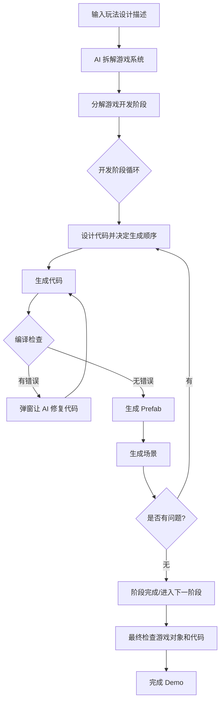

# AI 辅助游戏生成工具原型

## 项目简介

这是一个基于 Unity Editor 的 AI 辅助游戏生成工具原型，用于探索 AI 能否在半监督的条件下生成能够使用的项目文件。

### 该工具通过一份 玩法设计描述，引导 AI 系统化地拆解并规划游戏内容，包括：

	- 核心玩法与交互逻辑
	- 系统模块构成与职责分工
	- 开发阶段规划与执行顺序
	- 代码结构、Prefab 设计及场景构建方案

### 在生成过程中，AI 输出以 命令式指令（Command Line）和 JSON 数据 的形式进行，实现对游戏内容的结构化控制，包括：

	- 自动生成和修改 C# 脚本
	- 创建和配置 GameObject / Prefab
	- 选择和组合美术资源的呈现方式
	- 配置脚本字段类型（数值、Vector3、对象引用等）

### 在进行prefab/场景生成的时候，ai会在美术素材库中挑选合适的素材使用，
当前框架中，AI 对美术资源的使用是通过 Prefab 名称映射实现的，这意味着系统能够准确识别已有资源的内容并将其应用于生成的场景与 Prefab。
该机制天然支持 美术资源的扩展：新增资源可以直接加入库中供 AI 调用。
如果需要，甚至可以使用CLIP 等视觉模型对大量未命名资源进行命名，然后再导入此项目来使用

目前该项目以 可运行的 Unity Editor 工具 形态存在，适合作为 GamePlay 玩法 Demo 的快速生成与验证工具。
但从设计上看，该生成流程本身并不依赖 Editor 环境：只要具备对应的Logic Blocks与执行系统，同样的思路也可以被扩展到运行时，在游戏中动态构建游戏对象（比如敌人）地图，甚至一定程度上可以直接制作玩法

## 使用方式
流程设计：

### 入口：
打开 Unity 后，在菜单栏选择：

[Window -> AI 游戏制作助手]

初始化项目后，点击生成开发计划，然后输入玩法。(现在2d功能还没实现)

当前还没有实现网络接入功能，请先直接 复制 Prompt 并发送给 AI（推荐使用 DeepSeek Thinking），并把ai生成内容复制回来

如果生成内容有问题，可以在窗口输入文字发送给 AI 进行修改（功能尚未实现，目前可直接在聊天窗口与 AI 商讨）
内容确认无误后点击确认，系统会再次弹出 Request 窗口，将内容转换为 JSON

后续各阶段（代码生成、Prefab、场景）操作类似：
  弹出 Request AI Response 窗口 → 发送给 AI → 复制结果回到工具窗口

游戏开发阶段设计展示：

代码生成阶段展示

prefab阶段展示

场景阶段展示

debug验收阶段

还在制作

## 成果展示

### 角色生成

AI 成功挑选美术资源并附加到 GameObject 上
自动设置脚本字段，包括引用其他 GameObject 或 Component
  - player shooting在Fire point字段成功赋值了自己child object的transform
  - Bullet Prefab 字段成功赋值为另一个 GameObject；

这个例子展示了AI对全局资源引用关系的处理能力，不仅能生成单个角色，还能确保各个 GameObject、Prefab、Component 和脚本字段之间的引用关系正确

### 场景生成

AI 能根据美术资源限制和玩法需求生成合理的场景布局,比如意识到了地图边界可以用已有的资源-小山，来对玩家进行阻挡

这是它生成的第一个场景

对ai进行了两次对话后

ai成功改进了场景。

这说明ai
  - 不仅能生成场景还，具备“半监督迭代”能力，可让设计师或玩家通过文字调整生成结果  
  - 能够理解玩法需求
  - 能理解空间布局

## 未来改进

1 实现联网功能

2 完成在editor内与ai讨论的逻辑

3 在prefab与场景直接新增单独ui制作阶段

4 优化prompt

5 优化流程，让ai明确区分prefab制作，singleton制作，场景制作

6 支持2d功能

## 其他信息
美术库

